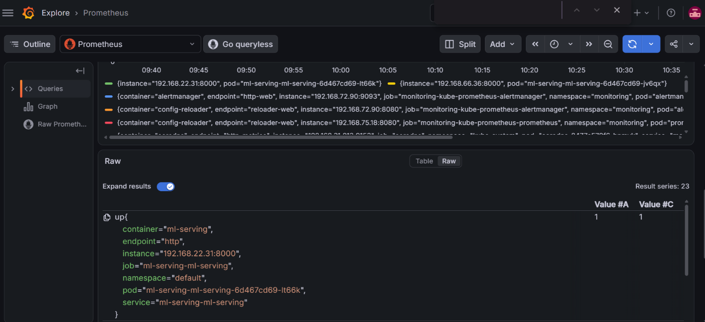

# ML model serving on Kubernetes with CI/CD

An end-to-end MLOps pipeline that takes a trained scikit-learn model from local development to a production-style, autoscaled, monitored deployment on Kubernetes — covering the same path a real ML service takes in a production environment.

## What this project demonstrates

- Training and serving a model behind a REST API (FastAPI)
- Containerizing it with Docker and pushing to a private registry (AWS ECR)
- Deploying to Kubernetes (AWS EKS) via a hand-written Helm chart, with health probes and horizontal autoscaling
- Wiring up real observability: Prometheus scraping app-specific metrics, visualized in Grafana

## Architecture

```
Train model (scikit-learn)
        |
Build & push image (Docker + ECR)
        |
Deploy to EKS (Helm chart, HPA, probes)
        |
FastAPI pods (autoscaled, 2-6 replicas)
   /                        \
Client                  Monitoring
(predict requests)      (Prometheus + Grafana)
```

## Stack

Python · FastAPI · scikit-learn · Docker · AWS ECR · AWS EKS · Helm · Kubernetes HPA · Prometheus · Grafana

## Screenshots

| | |
|---|---|
| **Pods running healthy on EKS** |  |
| **Grafana dashboard scraping app metrics** |  |

## Project structure

```
.
├── train_model.py          # Trains a RandomForest on the Iris dataset, saves model.joblib
├── requirements.txt
├── Dockerfile
├── .dockerignore
├── app/
│   └── main.py               # FastAPI app: /health, /predict, /metrics
└── helm/
    └── ml-serving/
        ├── Chart.yaml
        ├── values.yaml
        └── templates/
            ├── deployment.yaml
            ├── service.yaml
            ├── hpa.yaml
            └── servicemonitor.yaml
```

## API endpoints

| Method | Path | Purpose |
|---|---|---|
| GET | `/health` | Kubernetes liveness/readiness probe target |
| POST | `/predict` | Run inference — takes 4 flower measurements, returns predicted species |
| GET | `/metrics` | Prometheus scrape target |

## Run it locally

```bash
python -m venv venv
.\venv\Scripts\Activate.ps1        # Windows
pip install -r requirements.txt
python train_model.py               # trains model, saves app/model.joblib
uvicorn app.main:app --reload
```

Test it:
```bash
curl http://localhost:8000/health
curl -X POST http://localhost:8000/predict \
  -H "Content-Type: application/json" \
  -d '{"features": [5.1, 3.5, 1.4, 0.2]}'
```

Or open `http://localhost:8000/docs` for the interactive Swagger UI.

## Run it in Docker

```bash
docker build -t ml-serving:local .
docker run -p 8000:8000 ml-serving:local
```

## Deploy to Kubernetes (EKS)

```bash
# Build, tag, push
docker build -t ml-serving:local .
docker tag ml-serving:local <your-ecr-uri>/ml-serving:v1
docker push <your-ecr-uri>/ml-serving:v1

# Create cluster
eksctl create cluster --name ml-serving --region ap-south-1 --nodes 2 --node-type t3.medium --managed

# Deploy with Helm
helm install ml-serving ./helm/ml-serving

# Verify
kubectl get pods
kubectl port-forward service/ml-serving-ml-serving 8080:80
```

Full command history for every step (including monitoring setup and teardown) is in [`COMMANDS.md`](./COMMANDS.md).

## Challenges hit and fixed along the way

Real debugging, not a smooth tutorial run:

- **Prometheus wasn't scraping the app's metrics.** Traced it to the Kubernetes `Service` having a pod *selector* but no *labels* of its own — the `ServiceMonitor` matches against Service labels, not selectors. Fixed by adding `metadata.labels` to `service.yaml`.
- **Helm reported a successful deploy but created zero Kubernetes resources.** The chart's `templates/` folder didn't actually exist on disk despite appearing in the editor. Recreated it directly and verified with `helm template` before redeploying.
- **scikit-learn failed to install on Python 3.14** (no precompiled wheels yet for that version). Resolved by using a dedicated Python 3.12 virtual environment.

## What's next

- [ ] GitHub Actions workflow: build → push to ECR → `helm upgrade` on every push to `main`
- [ ] Load test with `hey`/`locust` to visually demonstrate HPA scaling
- [ ] Custom Grafana dashboard panel specifically for request rate/latency
